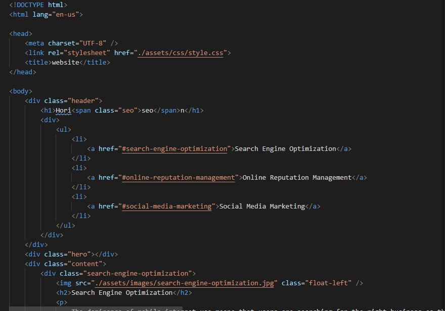
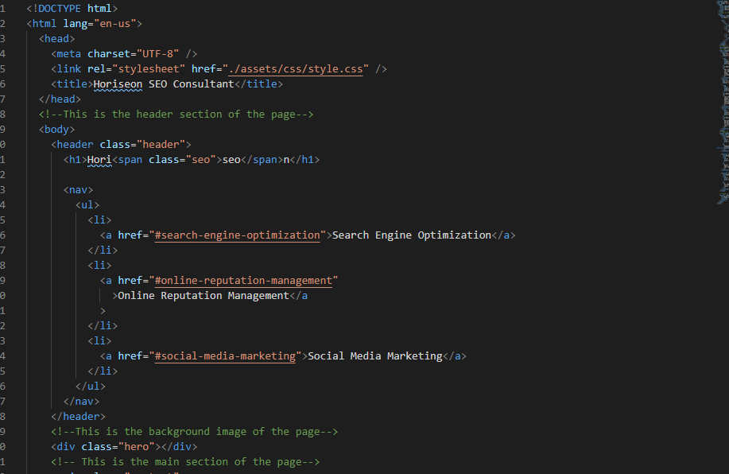
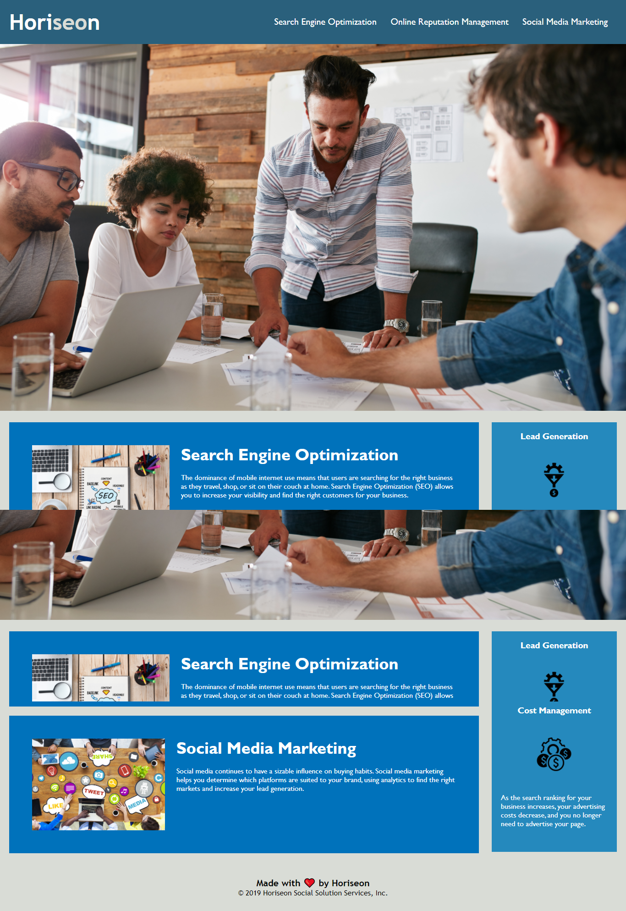

# Code Refactor Horiseon Project

# Project Link

Click here to view project on GitHub Pages
https://otivisan22.github.io/Code_Refactor_Horiseon/

# Horiseon Project

## Description

As a marketing agency we were tasked to refactor the page for Horiseon by adding Semantic HTML elements and making the website more accessible.
This is a summary of the refactoring Horiseon SEO Consultants.

# Getting started

- Clone the GitHub project into your local machine
- Navigate into the project
- Open the project into VSCode
- Open the 'index.html' into your default browser

git clone git@github.com: git@github.com:otivisan22/Code_Refactor_Horiseon.git
cd homework_1
code .

# What did we do?

- Updated title of the webpage with SEO Consultant
- Replaced HTML elements with semantic HTML elements
- Fixed Nav Link Bug
- Made the images more accessible by adding alt attributes
- Formatted code using lint (prettier)
- Consolidated and refactored the CSS style according to semantic HTML elements
- Commented the styling that has been refactored

## Code Before/After

# Screenshots

There are two screenshots stick together

# Testing

- A series of tests were performed and established after each change of html elements to semantic HTML elements
- A number of tests were performed after refactoring the styling of the page according to the semantic HTML elements.
